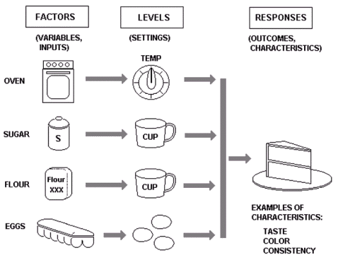

Design of Experiments
---------------------

Design of Experiments (DoE) represents a systematic method to determine the
relationship between factors and their interactions to assess how these are
affecting the output of that process. It is essentially an approach to
determining 'cause and effect' relationships. The DoE method is used to maximize the information obtained from experimental data
through very few trials or runs. Four approaches to DoE are listed below:

1. Full factorial
2. Fractional factorial
3. Taguchi Methods
4. RSM (Response Surface Methodology)

There are typically three components which comprise experimental design. These
are detailed below. We take a simplistic example of a cake-baking process to
contextualise the DoE approach:

* **Factors** represent the inputs to the process: These can be stipulated as either controllable or uncontrollable variables. In the cake-baking process example these would correspond to the oven and ingredients typically.
* **Levels** represent the settings of each factors. Typical examples of this in the cake-baking process would be the oven temperature and the ingredient amounts included.
* **Responses** represent the output of the experiment. In the simplistic case of baking a cake these responses could manifest themselves in the form of the taste, consistency and the appearance of the cake. These responses are ultimately affected by the level settings of each factor.

**Figure 10** presents the typical DoE approach to baking a cake,
highlighting the factors, levels and typical responses.

**Figure 10**: An example of a DoE approach to baking a cake.

The rationale supporting the cake baking DoE approach is as follows:

* **Comparing Alternatives** - We may want to compare the results from two different types of flour, if it turned out that flour types produced similar results, we could purchase from the low cost supplier.
* **Significant Control Factors** - We may want to determine what the significant factors are.
* **Optimal Process Output** - Enables determination of the optimal set of factors and corresponding level  to achieve the exact taste and consistency.
* **Reducing Variability** - Can the recipe be changed slightly without detriment to the responses.
* **Improving Process Robustness** - Improving the fitness for use under varying conditions. For example, can the factors and their levels (recipe) be modified such that cake will come out nearly the same, irrespective of what oven is used.

The pertinent benefits of the DoE approach are as follows:

1. Quick, economical and efficient method to identify most significant input
factors.
2. Simultaneous trials with multiple control factors instead of one variable at a
time.
3. Gives interaction effects of control factors.
4. Fewer simulations required to get process insight.
5. Factor effects can be easily measured.
6. Explore relationship of response and control factors.
7. Cheaper than reducing fabrication or simulation bottlenecks.
