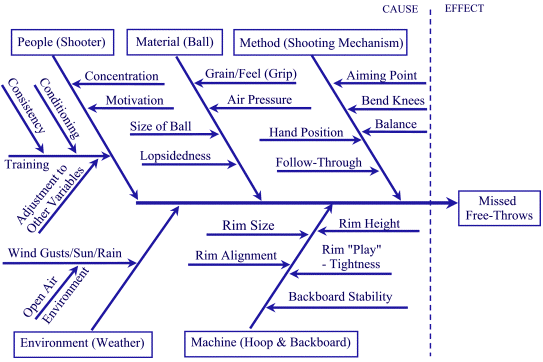

Fishbone Ishikawa Diagrams
--------------------------

Ishikawa diagrams (also called fishbone diagrams) are causal diagrams that show
the causes of a specific event. Common uses of the Ishikawa diagram are product
design and quality defect prevention to identify potential factors causing an
overall effect. Each cause or reason for imperfection is a source of variation.
Causes are usually grouped into major categories to identify these sources of
variation. The categories typically include:

* People: Anyone involved with the process
* Methods: How the process is performed and the specific requirements for doing it, such as policies, procedures, rules, regulations and laws
* Machines: Any equipment, computers, tools, etc. required to accomplish the job
* Materials: Raw materials, parts, pens, paper, etc. used to produce the final product
* Measurements: Data generated from the process that are used to evaluate its quality
* Environment: The conditions, such as location, time, temperature, and culture in which the process operates

A typical, simplistic example of an Ishikawa diagram is presented below:

There have been identified topics for fishbone diagram cause classes in different areas of development. They are grouped into easily remembered sets. Examples are:

* The 5 M's (used in manufacturing industry): 
&nbsp;&nbsp;&nbsp;&nbsp;&nbsp; * Machine (technology)
&nbsp;&nbsp;&nbsp;&nbsp;&nbsp; * Method (process), 
&nbsp;&nbsp;&nbsp;&nbsp;&nbsp; * Material (Includes Raw Material, Consumables and Information.), 
&nbsp;&nbsp;&nbsp;&nbsp;&nbsp; * Man Power (physical work)/Mind Power, Measurement (Inspection)

* The 8 P's (used in marketing industry): 
&nbsp;&nbsp;&nbsp;&nbsp;&nbsp; * Product/Service
&nbsp;&nbsp;&nbsp;&nbsp;&nbsp; * Price
&nbsp;&nbsp;&nbsp;&nbsp;&nbsp; * Place
&nbsp;&nbsp;&nbsp;&nbsp;&nbsp; * Promotion
&nbsp;&nbsp;&nbsp;&nbsp;&nbsp; * People/personnel
&nbsp;&nbsp;&nbsp;&nbsp;&nbsp; * Process
&nbsp;&nbsp;&nbsp;&nbsp;&nbsp; * Physical Evidence
&nbsp;&nbsp;&nbsp;&nbsp;&nbsp; * Publicity. 

The 8 P's are primarily used in service marketing.
*The 4 S's (used in service industry): 
&nbsp;&nbsp;&nbsp;&nbsp;&nbsp; * Surroundings
&nbsp;&nbsp;&nbsp;&nbsp;&nbsp; * Suppliers
&nbsp;&nbsp;&nbsp;&nbsp;&nbsp; * Systems
&nbsp;&nbsp;&nbsp;&nbsp;&nbsp; * Skills

