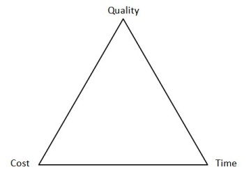

Impact of Quality on Cycle Time and Cost
----------------------------------------

These three project managment constraints are traditionally represented in
what is known as the "Iron Triangle", depicted in **Figure 2**.

**Figure 2**: The Iron Triangle.

The relationship between the three constraints means that management staff
end up having to make a choice between two out of the three of them; in
other words, "Pick any two". Accordingly, one of the following is likely to
occur:

* Designing a product to a high standard with a low time to market, at the cost of being expensive
* Designing a product quickly and at a low cost, at the expense of the product quality
* Designing a product to a high standard and at a low cost, but taking a long time to market.
