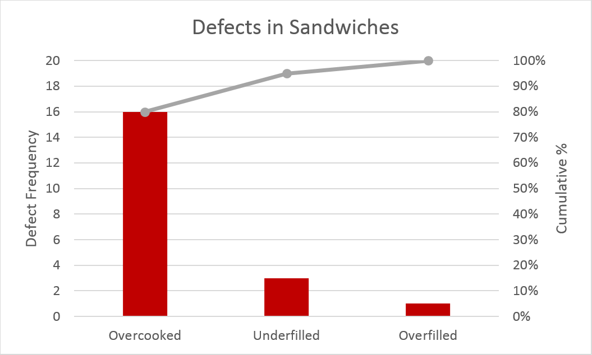

Pareto
------

The Pareto principle (also known as the 80 - 20 rule, the law of the vital few,
and the principle of factor sparsity) states that, for many events, roughly 80%
of the effects come from 20% of the causes. The term 80 - 20 is only a shorthand
for the general principle at work. In individual cases, the distribution could
just as well be, say, 80 - 10 or 80 -30. There is no need for the two numbers to
add up to the number 100, as they are measures of different things. A simple
example of a pareto chart is presented below.

Adding up to 100 leads to a nice symmetry. For example, if 80% of effects come
from the top 20% of sources, then the remaining 20% of effects come from the
lower 80% of sources. This is called the "joint ratio", and can be used to
measure the degree of imbalance: a joint ratio of 96:4 is very imbalanced, 80:20
is significantly imbalanced, 70:30 is moderately imbalanced (Gini index: 40%), and
55:45 is just slightly imbalanced.

This principle is particularly prominent in the field of Software Engineering,
as highlighted by the following examples:

Microsoft noted that by fixing the top 20% of the most-reported bugs, 80% of the
related errors and crashes in a given system would be eliminated.

In load testing, it is common practice to estimate that 80% of the traffic occurs
during 20% of the time.

In Software Engineering, Lowell Arthur expressed a corollary principle: "20 percent
of the code has 80 percent of the errors. Find them, fix them!"
