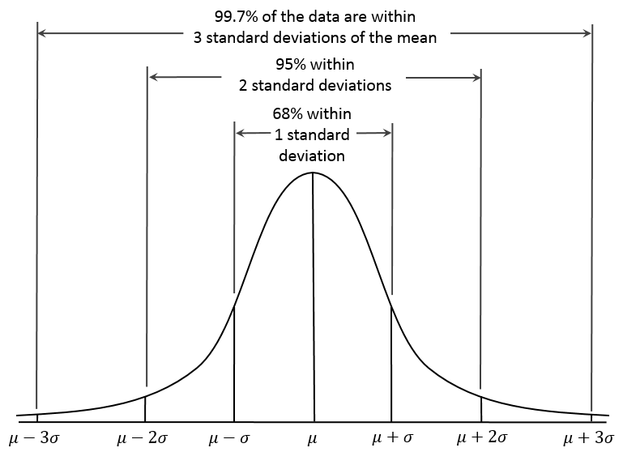
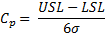
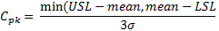
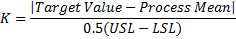
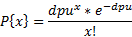
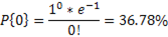

Six Sigma
---------

Six sigma represents a set of techniques and tools for implementing process
improvement. This improvement is achieved through identifying and subsequently
removing the causes of defects, thus minimising variability in manufacturing and
business processes. A six sigma process is one in which 99.99966% of all
opportunities to produce some feature or part are statistically expected to be
free of defects (3.4 defective features per million opportunities). A defect in
this sense can be defined as any variation of a required characteristic of the
product for its parts, which is far enough removed from its nominal value to
prevent the product from fulfilling the physical and functional requirements of
the customer.

Normal distribution curves (**Figure 1**) are symmetrical about the mean value (μ), with the
total area under the curve equating to one. If a process is classified as 3
sigma, 99.7% of outputs are defect free. Mean is the central tendency of the
process, or the average of all values within the population. The standard
deviation (σ) is a measure of dispersion or variability.

**Figure 1**: A normal distribution curve, with the standard deviations from the mean marked.

The upper specification limit (USL) and the lower specification limit (LSL) set
permissible limits for the process variation. For example, the USL and LSL of a
process may be set at 3σ and -3σ, thus yielding a process which is 99.7% defect
free. USL represents a value designating an upper limit above which the process
or characteristic performance is unacceptable. In the converse case, the LSL
represents a value designating a lower limit, below which the process or
characteristic performance is unacceptable.

The relationship between yield, variability and specification limits is that
essentially the specification limits provide the permissible process variations.
Minimising variability therefore inherently leads to a better yield, as the
probability of defects occurring is substantially mitigated.  Cp and Cpk
represent metrics of process quality. Cp is a measure of how capable the process
is of producing the required process characteristic. Cp is known as the
capability index, or design margin, and is calculated using the following
equation:

Cpk is a measure of actual performance which takes the operating mean into account.
Cpk is equal to Cp when the process mean is equal to the target, or nominal
value. Cpk accounts for the process mean not hitting the target
value. The following calculations can be used to determine Cpk.

Poisson distributions describes the probability distribution of an event
occurring with respect to time, or space. The eventual process yield can be
calculated using Poisson's formula as presented below, where dpu is the
measured defects per unit.

As an example, if average `dpu = 1`, the probability of having a device with no
defects can be calculated as:

