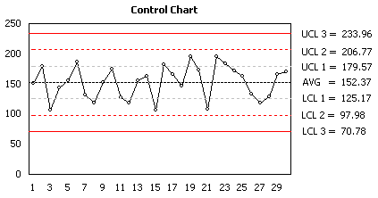

Statistical Process Control
---------------------------

Statistical process control (SPC) is a method of quality control which uses
statistical methods. SPC is applied in order to monitor and control a process.
Monitoring and controlling the process ensures that it operates at its full
potential. In this case, the process can make as many conforming
products as possible while minimising waste. SPC can be applied to any process where the "conforming product"
(product meeting specifications) output can be measured. Key tools used in SPC
include control charts; a focus on continuous improvement; and the design of
experiments. An example of a process where SPC is applied is manufacturing
lines. It uses a process of physical inspection to separate good products from
bad.

A key part of statistical process control is producing control charts (**Figure
7**) which can be used for visualising effects of eliminating process issues
over time.

**Figure 7**: Quality Control Chart

### Objective analysis of variation

SPC must be practiced in 2 phases: The first phase is the initial establishment
of the process, and the second phase is the regular production use of the
process. In the second phase, a decision of the period to be examined must be
made, depending upon the change in 4 - M conditions (Man, Machine, Material,
Method) and wear rate of parts used in the manufacturing process (machine parts,
jigs, and fixture).

### Emphasis on early detection

An advantage of SPC over other methods of quality control, such as "inspection",
is that it emphasizes early detection and prevention of problems, rather than
the correction of problems after they have occurred.

### Increasing rate of production

In addition to reducing waste, SPC can lead to a reduction in the time required
to produce the product. SPC makes it less likely the finished product will need
to be reworked upon completion.

### Limitations

SPC is applied to reduce or eliminate process waste. This, in turn, eliminates
the need for the process step of post-manufacture inspection. The success of SPC
relies not only on the skill with which it is applied, but also on how suitable
or amenable the process is to SPC. In some cases, it may be difficult to judge
when the application of SPC is appropriate.

