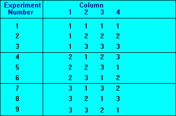

Taguchi
-------

The Taguchi approach to Design of Experiments (DoE) necessitates the use of
orthogonal arrays to implement fractional factorial experiments. Orthogonal in
this sense essentially states that each control factor in the experiment is
independent of each other and can thus be evaluated independently.  The general
approach to establishing Taguchi experiments is a three step process, as listed
below:

1. Identify the number of control factors required.
2. Select the number of level settings for each control factor.
3. Select an appropriate pre-defined Taguchi Array depending on the number of
control factors and levels.

The three step process shall essentially define the number of experimental runs
required. As an example, **Figure 8** below represents a L9 orthogonal array which
accounts for 4 control factors operating with 3 levels. It should be noted that
there are an equal number of level 1, 2 and 3 settings across the nine
experiments. In addition, there are an equal number of 1, 2 and 3 level settings
for every other factor across all experimental runs.

**Figure 8**: An example of a Taguchi Array.

A more comprehensive list of available [Taguchi
Arrays](http://www.york.ac.uk/depts/maths/tables/orthogonal.htm) can be
consulted. The Taguchi process enables the addition of noise factors into the
experiment. The noise is introduced into each run, with the resulting variation
quanitfied as a comparable Signal to Noise Ratio (SNR). Control factor settings
that minimise SNR are chosen to yield the most robust process possible. Noise
added experiments are performed using duplicate Taguchi arrays to model the
addition of the noise contol factors. An L9 Taguchi array with noise is
presented in Figure 9 below.

**Figure 9**: An example of a Taguchi Array with noise.

The confirmation run is a crucial requirement when using Taguchi Arrays. Confirmation
runs are needed in order to validate experimental success or identify problems with
the experiment. These problems may potentially manifest themselves in the form of
factors left out of the experiment, or interactions between the included control
factors. The underlying advantages and limitations of Taguchi's approach to
fractional factorial experiments are presented below.

Advantages:

* Orthogonal arrays reduce number of exprimental runs
* Simple calculations
* Enabled effect of control and noise factor variation to be optimised

Limitations:

* Does not deal well with interactions
* Not suited to multi-characteristic optimisation
* Large number of runs when using noise arrays
